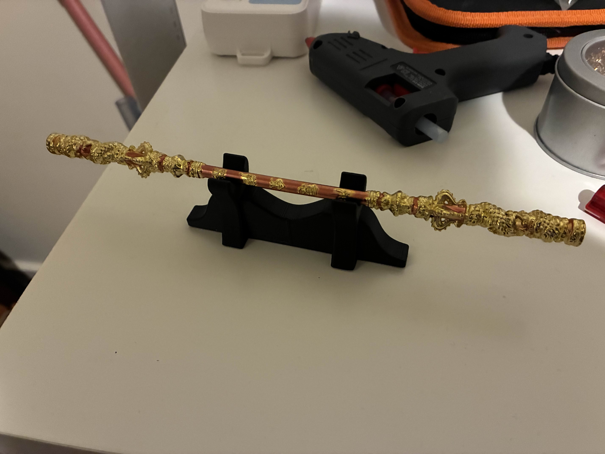
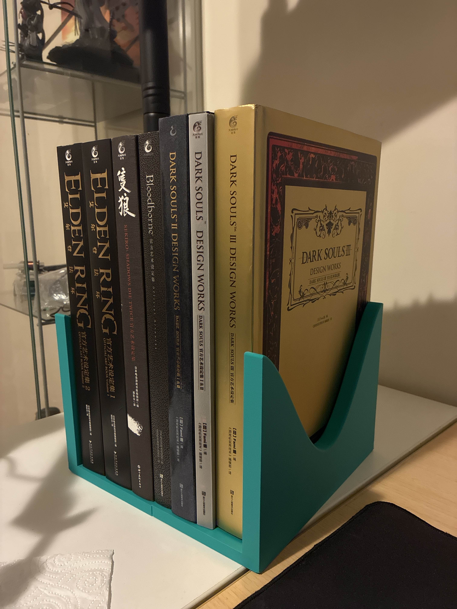

<link rel="stylesheet" href="/portfolio-v1/style.css">

# Computer Assisted Design (CAD)
#### Date in ascending order

**My Blue Water Bottle 30/9/2025**

Completion time: 30 minutes

 

  <figure>
    
    <figcaption style="display: block; text-align: center;">My Blue Bottle</figcaption>
  </figure>

 

  <figure>
    
    <figcaption style="display: block; text-align: center;">My attempt of designing my bottle in f360</figcaption>
  </figure>

 
 
 

**Horizontal Stand Display 30/9/2025**

Completion time: 10 minutes

 

  <figure>
    
    <figcaption style="display: block; text-align: center;">Fit quite well for my mini wukong staff imo</figcaption>
  </figure>

 
 
 

**Bookshelf 26/12/2025**

Completion time: 45 minutes

 

  <figure>
    
    <figcaption style="display: block; text-align: center;">Literally perfect for all my fromsoftware books.</figcaption>
  </figure>

