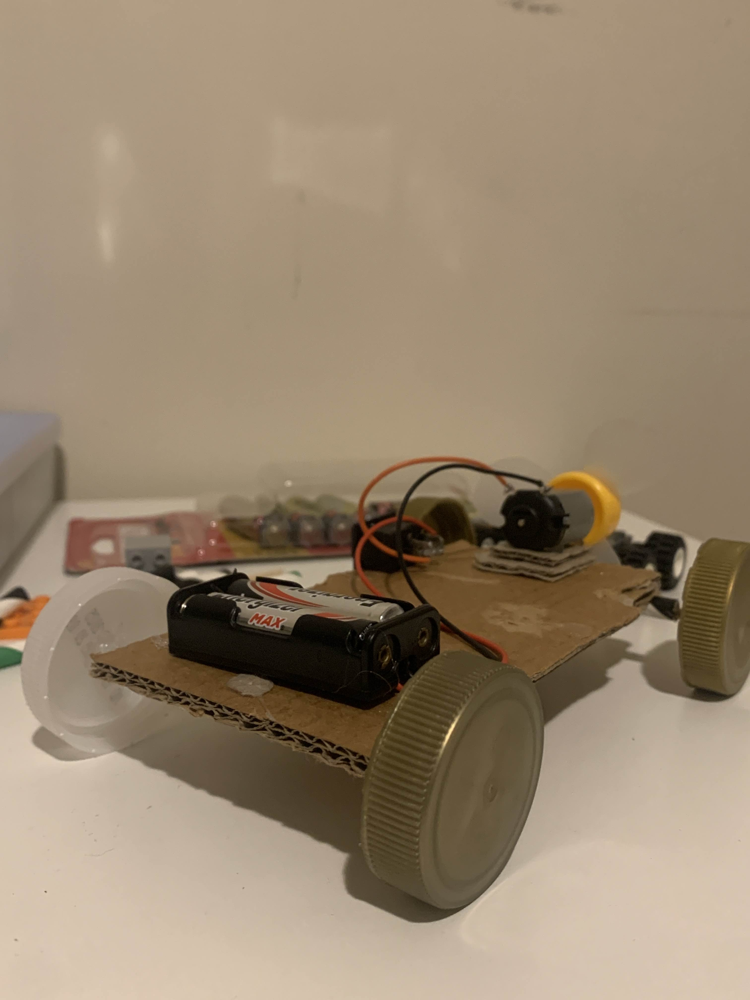

# Soldering 

**Fan Blade Car 11/8/2025**

Completion time: 1 hour

<figure style="display: block; width: fit-content; margin: auto;">
  
  <figcaption style="display: block; text-align: left;">Learnt simple circuitry and basic wire soldering</figcaption>
</figure>

 
 
 
 

**Solder Fume Hood 15/8/2025**

Completion time: 30mins

<figure style="display: block; width: fit-content; margin: auto;">
  
  <figcaption style="display: block; text-align: centre;">Built it in preparation for more soldering, this apparatus sucks in solder fume and the carbon filter on the other end filters out the harmful chemicals.</figcaption>
</figure>

 
 
 
 

**Ceramic Filament Display 26/8/2025**

~*60 parts* Completion time: 2 hours

<figure style="display: block; width: fit-content; margin: auto;">
  
  <figcaption style="display: block; text-align: centre;">During the assembly of this project, I improved my soldering skill on different electrical components, I made mistakes during the assembly that gave me the chance to improve my desoldering skill.</figcaption>
</figure>

