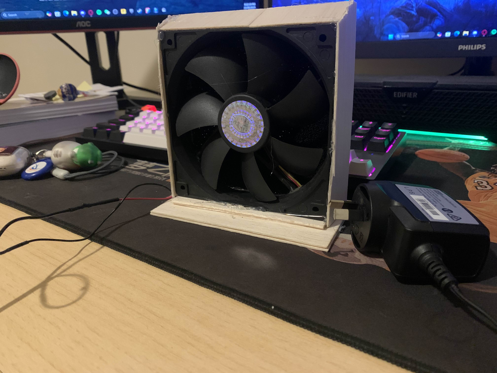
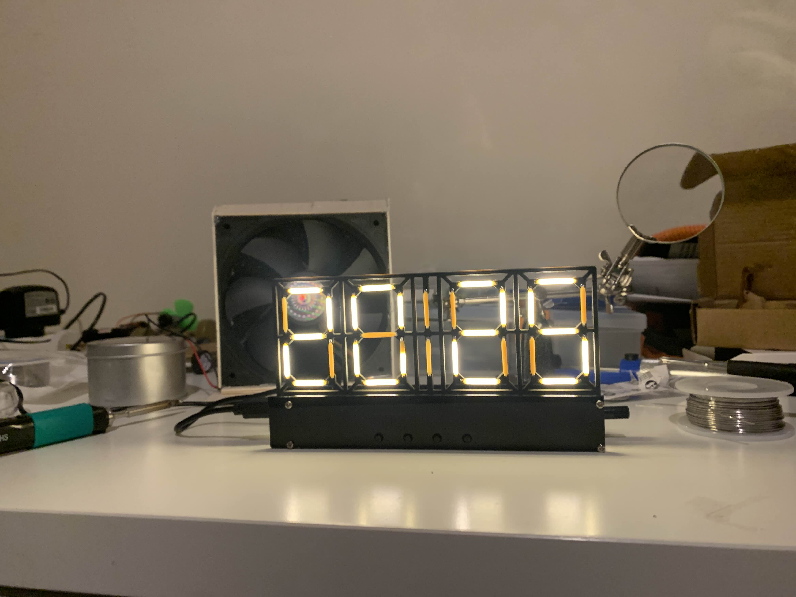

# Soldering 

**Solder Fume Hood 15/8/2025**

Completion time: 30mins

Built it in preparation for Soldering, this apparatus sucks in solder fume and the carbon filter on the other end filters out the harmful chemicals.

 
 

**Ceramic Filament Display 26/8/2025**

~*60 parts* Completion time: 2 hours

During the assembly of this project, I improved my soldering skill on different electrical components, I made mistakes during the assembly that gave me the chance to improve my desolering skill.
