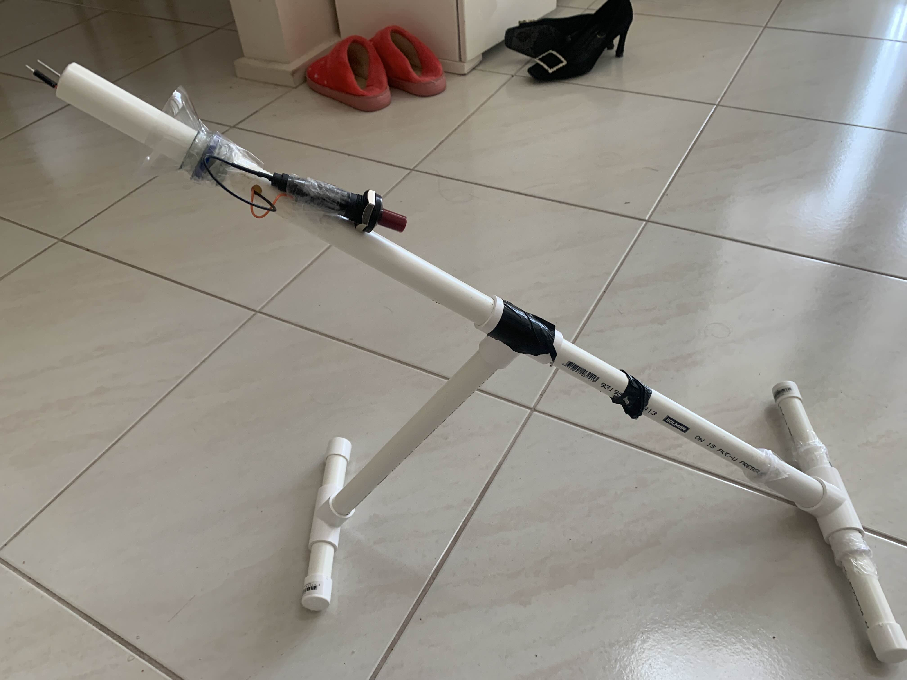

# Backyard science projects 

yea so i cant be fucked formatting it (sorry lol), but here is a bunch of shit ive done before I even considered engineering seriously

## Piezoelectric Bottle Launcher 2024
<figure style="display: block; width: fit-content; margin: auto;">
  
</figure>

## Piezoelectric cannon 2024
<figure>
  <video src="Images/patata.mov" controls width="800" loop muted></video>
</figure>

## Blow dart gun 2024
<figure style="display: block; width: fit-content; margin: auto;">
  
</figure>

## Sugar rocket 2024
<figure>
  <video src="Images/rocket.mov" controls width="800" loop muted></video>
</figure>
