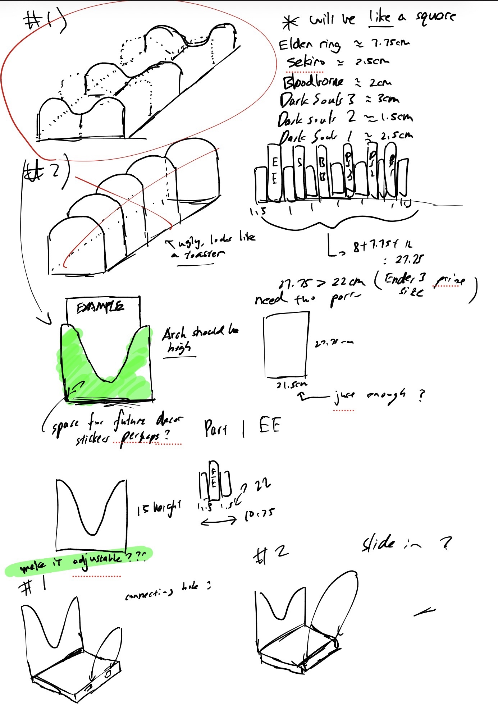
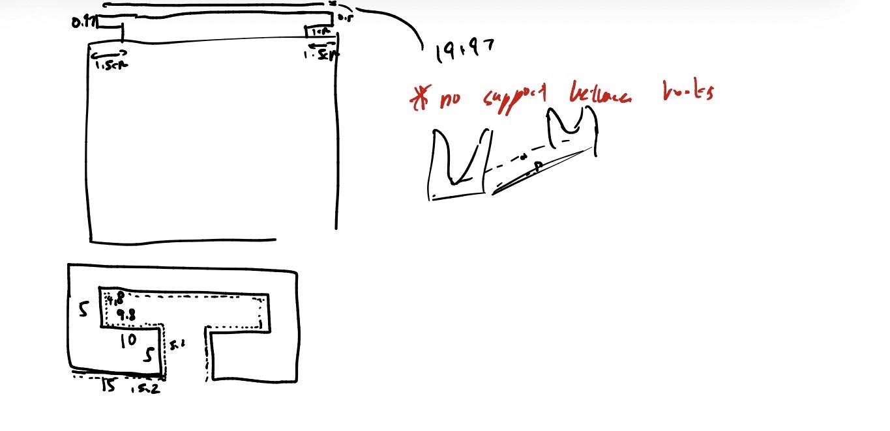
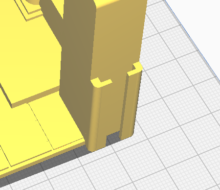
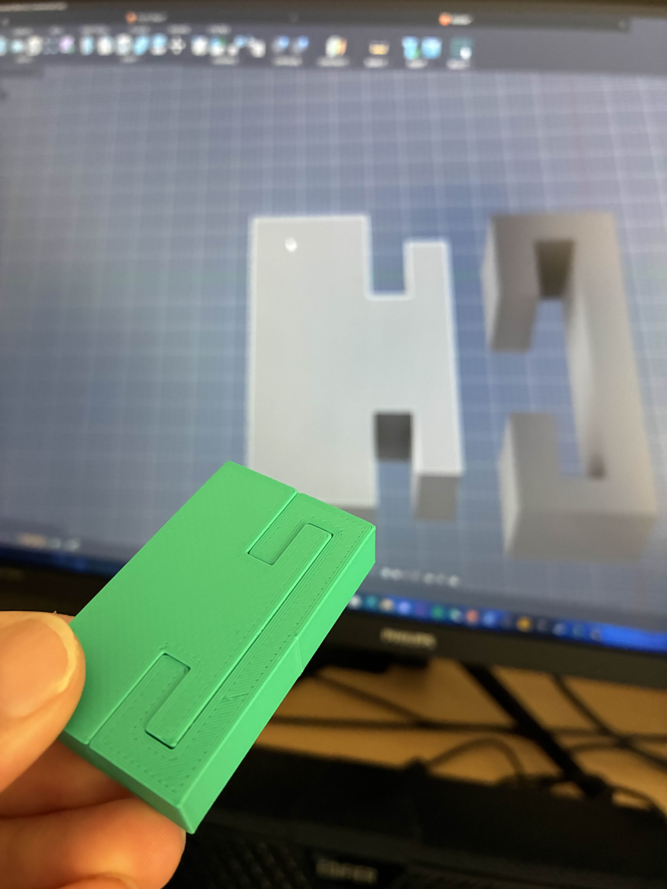

# Bookshelf for my Fromsoftware books 📚🔧

## 📌 Overview
I bought about 1000 yuan (212 aud) worth of Fromsoftware Books, and i need a bookshelf for it. At the start i was browsing online for cool bookshelf, but all of them are either too complicated for my old, not so high quality seconded handed ender 3 pro, too small or i just dont like the style. So i just ended designing a really simple book shelf that is also big enough to fit all my books. The bookshelf is split into two halves, with a simple joint mechanism to connect the two.
  
Through this small project, I developed critical thinking through measurements and designing, I also had an introduction on tolerance and joint mechanism.  

**Outcome:** A bookshelf that is big enough for my books!

---

  
  
  
<em>rough brainstorm of the bookshelf design.</em>

---

## 💡 Joint Mechanism

I took inspiration of this random bookshelf design on makerworld, it uses this joint mechanism (i dont know the name of this)

  
  
<em>This is the one im talking about.</em>

 
 

I adapted this idea into my bookshelf and it was a lot more simple.

  
  
<em>Making sure it works first so I did a test print, and it worked well.</em>

 
 

# FINAL

  
  
<em>Looked just as expected, the joint still works but it was a bit hard to connect, had to half connect one side and then just push it hard to make it fit in,  after connection it stays really stable.</em>

---

