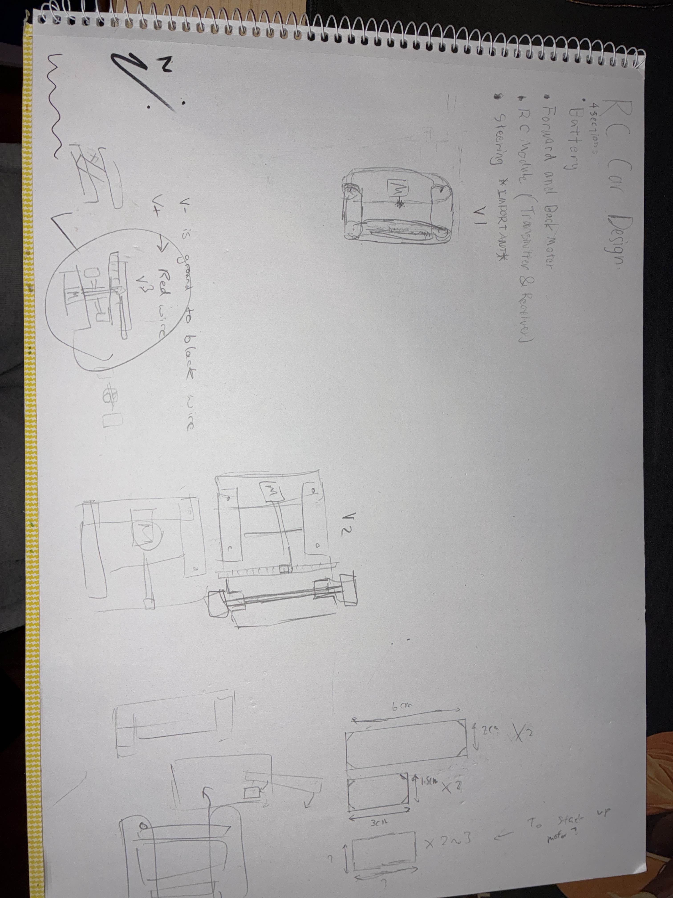
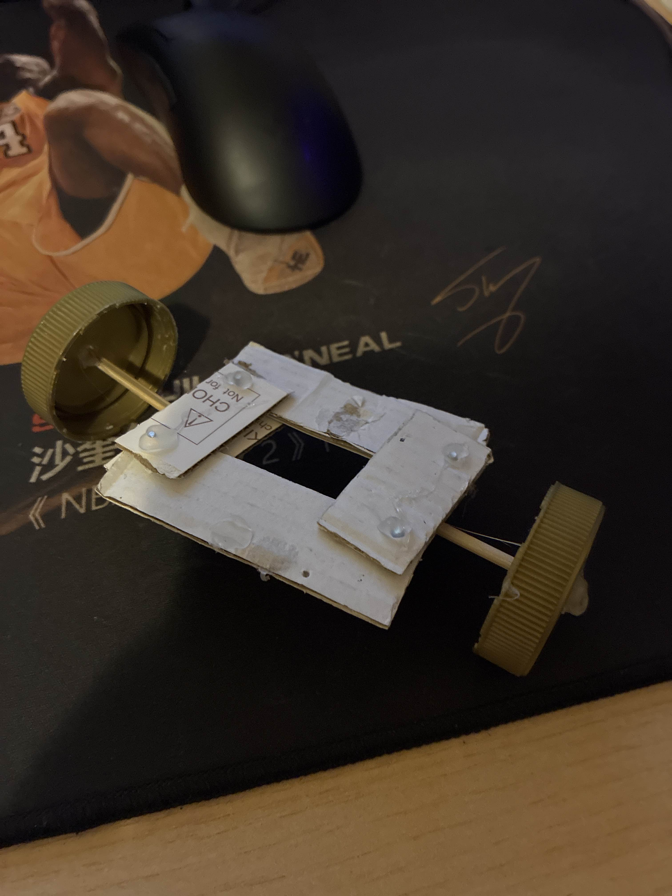
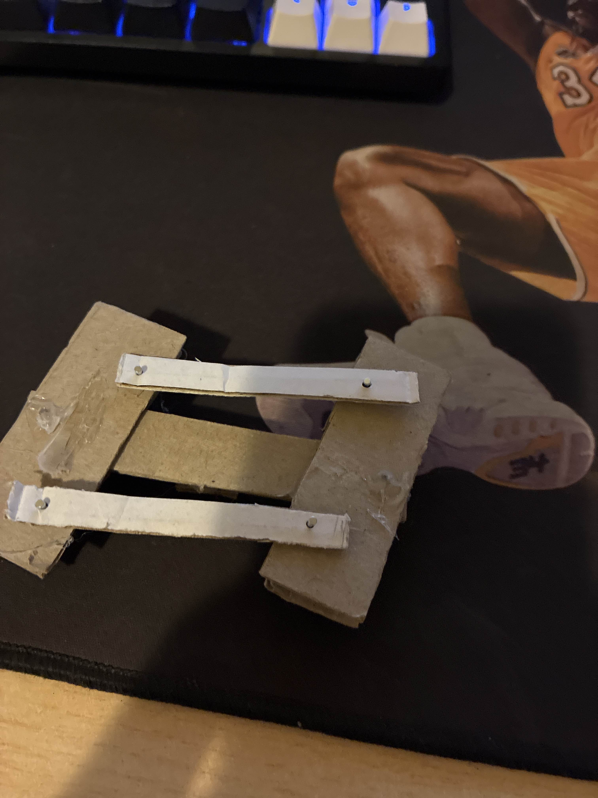
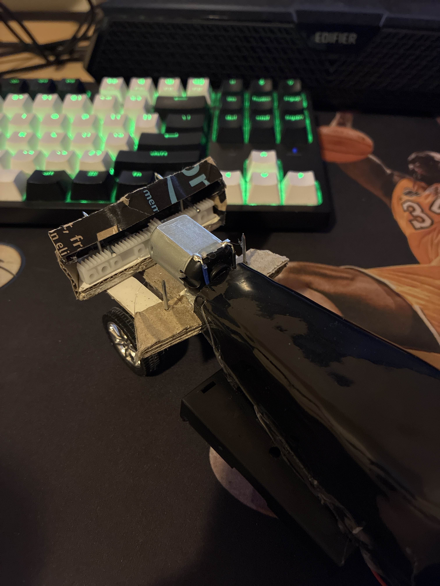

# Remote Control Car Project 🚗🔧

## 📌 Overview
Me and my friend like thingies that move, so it becomes natural for us to build a RC car.
This project fulfilled our interest and also improved our problem solving and creative thinking, especially in the engineering field.
it also enchanced our hands-on experience with tools.

The RC car is controlled via an 27 MHz 4CH RC module(transmitter and receiver), with a wood chassis, plastic over and used double battereies to power 2 dc motors.  
Through this project, we explored **circuit wiring, steering design, sketching, experimenting design and troubleshooting hardware problems**.  

**Outcome:** A fully functional RC car capable of forward/reverse driving, turning.

---

## 🛠️ Materials & Components
### Electronics
- 27Mhz 4CH RC transmitter
- 27Mhz 4CH RC receiver
- 3-6V DC motors  
- Wires    
- AA Batteries  

### Mechanical
- Wood Chasis
- Cardboard
- Plastic Cover
- 4 × Wheels with rubber tires  
- Axles 
- Heat shrnk tubing 
- Screws, nuts, and nails  

### Tools & Software
- Soldering iron   
- Hot glue gun   
- Pliers
- Multipurpose wire stripper.
- Scissor
- Pencil
- Sketching book

- ---

  
  
<em>rough sketches of steering system designs.</em>

 
 

  
  
<em>version 1 of steering system, failed due to invalid dimension and insufficient space to implement.</em>

  
  
<em>version 2 of steering system, improved with more space and easy to implement, howver failed due to motor unable to produce enoygh torque when being placed too far in the back.</em>

  
  
<em>version 3 of steering system, improved from v2, added suppports, made everything more compact and effcicient, put motor closer to ensure enough torque</em>

