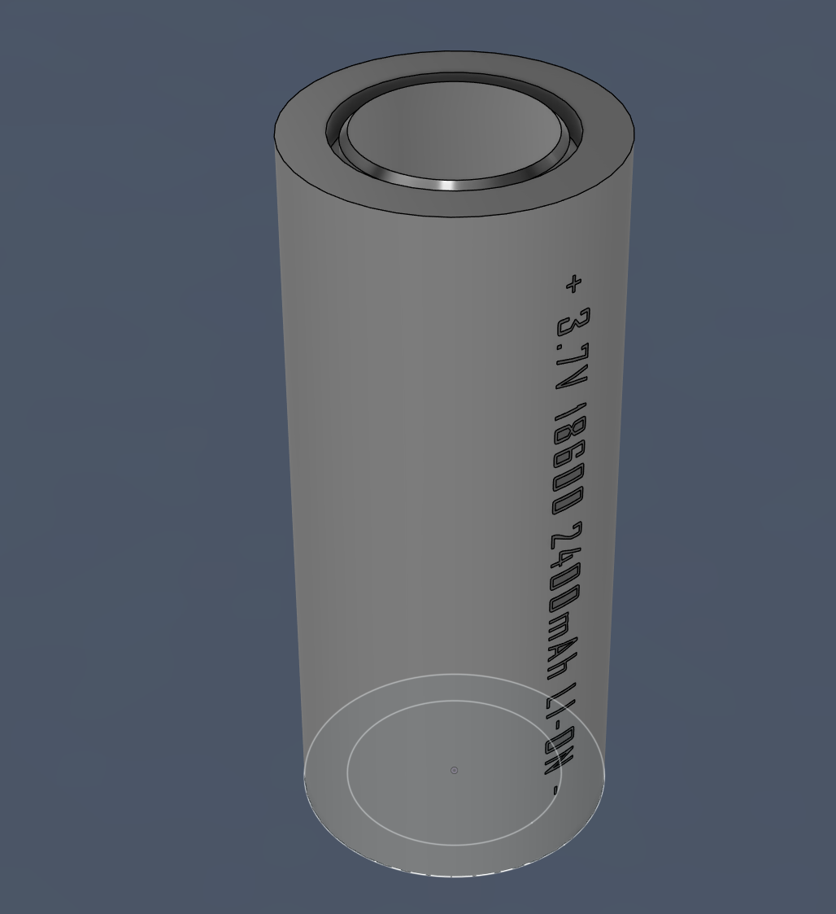
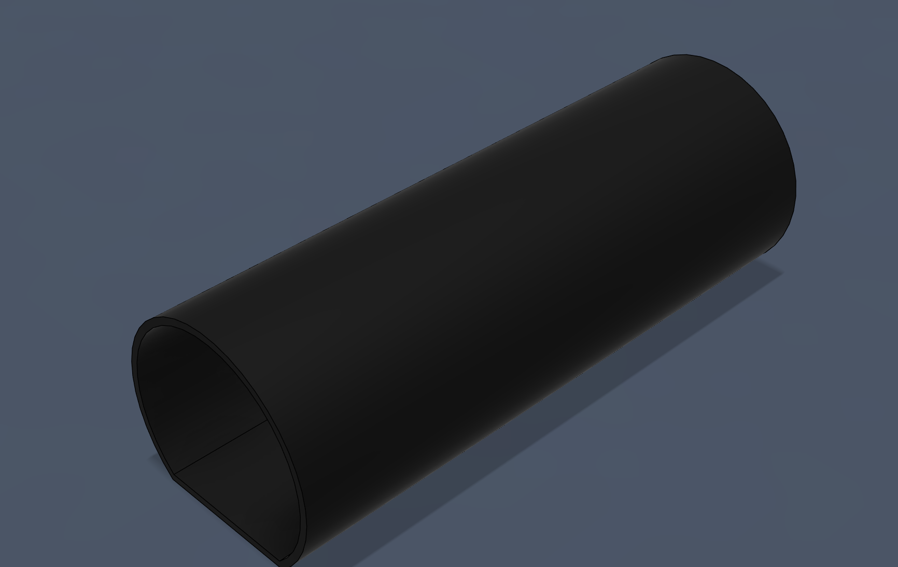
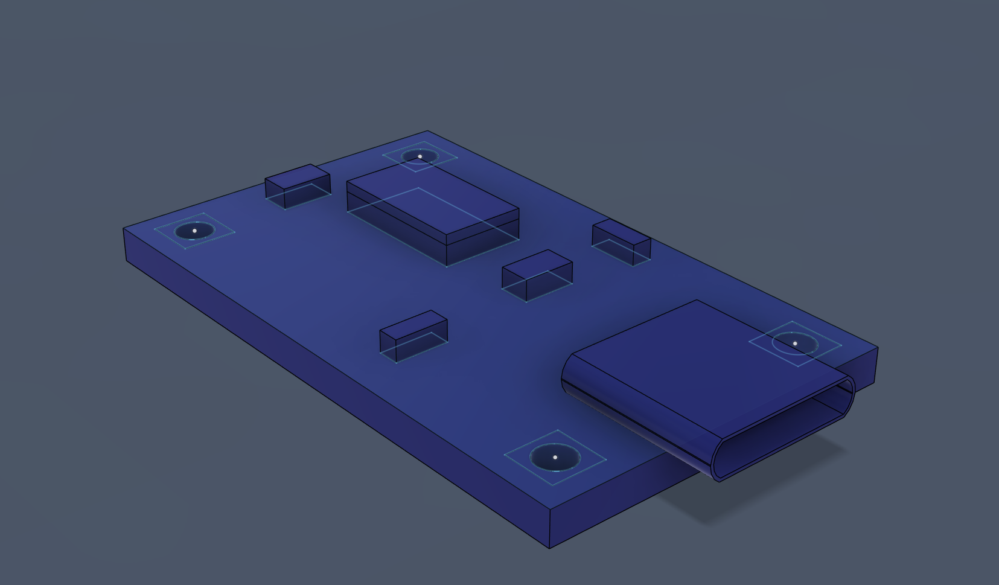
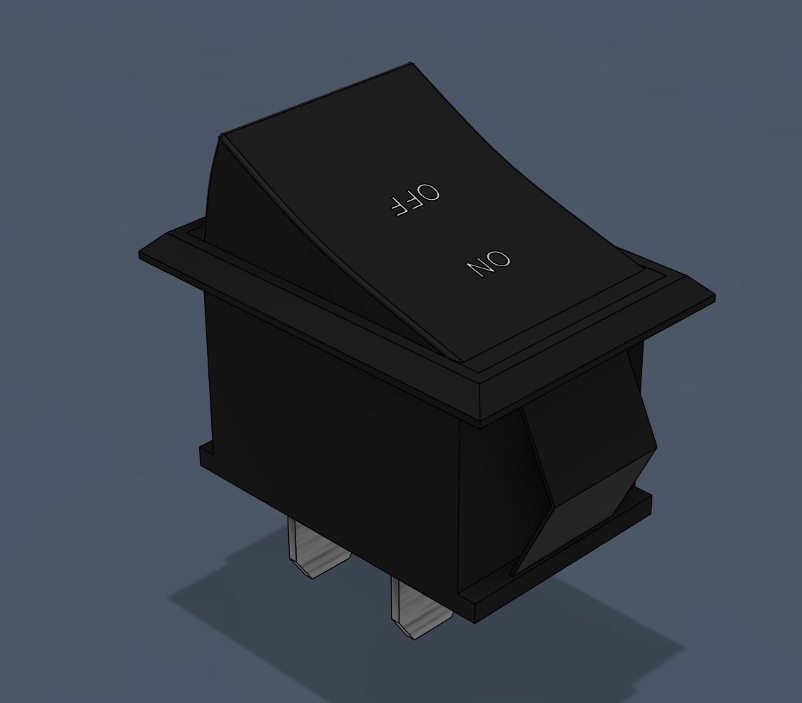
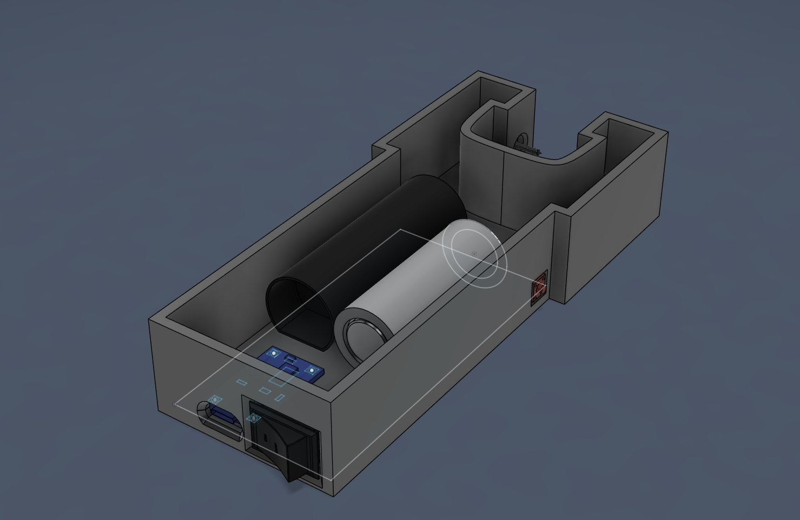
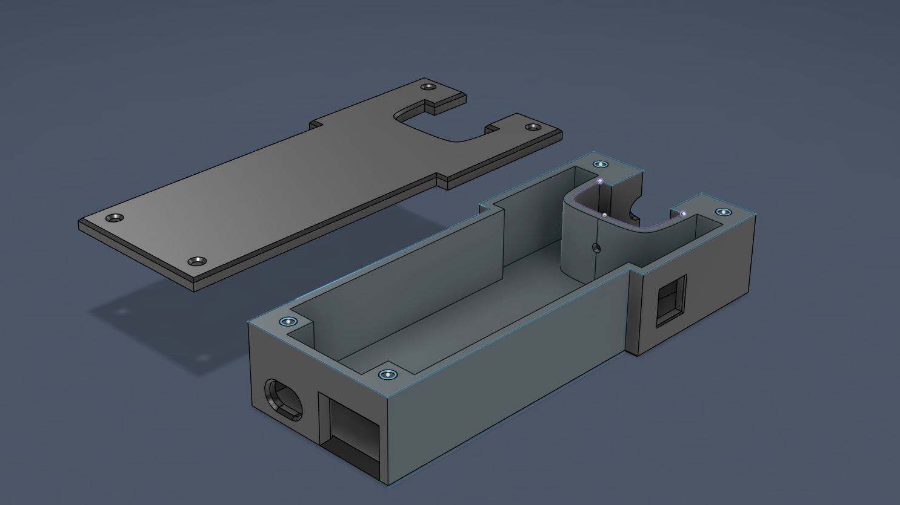

# Taser ⚡🔧

## 📌 Overview
I finally got my hand on a 3d printer and i wanted to test my CAD skills, and for some reason my mind told me hey designing a case for a taser would be fun and beneficial.
This project tested my skill and also improved my problem solving and creative thinking, especially in the engineering field.
It also enchanced my hands-on experience with tools as I had to do a quite a bit of tinkering and soldering.

The taser uses a 3.7V lithium ion battery. It recharges using a tp4056 board, has a safety switch design.  

I was able to find out some useful information online about the electrical compoenents of a taser. However I found no luck for the case, so I designed the case completely on my own with nothing in reference to.

**Outcome:** A fully functional taser that can devliver high voltage.

---

## 🛠️ Materials & Components
### Electronic
- 3.7V lithium ion battery
- Step up high voltage transfomer
- TP4056 USB C recharging board.
- Wires    
- Push button
- On and Off Button
- Green LED  
- 100ohm resistor
### Mechanical
- PLA case
- M3 Threaded Inserts
- M3 Screws 

### Tools 
- Soldering iron   
- Hot glue gun   
- Electrical Tape
- Multipurpose wire stripper.
- Scissor 

- ---

## STEP 1 : Model everything
To make sure all the components can fit into the case, I started by individually modelling all the components of the Taser.

  
  
<em>3.7V Battery.</em>

 
 

  
  
<em>Step up high voltage transformer.</em>

  
  
<em>TP4056</em>

  
  
<em>On and Off Switch, I also modelled the push button</em>

---

## In addition I did some brainstorming while waiting for the parts to arrive.

  
  
<em>some random brainstorm</em>

---

## STEP 2: Printing and Testing

  
  
<em>Version 1 of the taser.</em>

### Problems of v1
- The hole for on and off switch is not big enough
- The hole for tp4056 is not big enough and is placed slightly too low
- Strength of walls are not good enough, vulnerable to cracks

 

  
  
<em>Version 2 of the taser, hole problem imporved using offsets and projection, strength fixed by increasing thickness and infill% of print, also made probe circles better.</em>

### Problems of v2
- TP4056 is stil kinda awkward, should be placed higher.
- Probe circle size is fine but position is not optiaml, it should be placed in the orners so it looks like a 八 shape.
- push button's location doesn't feel ergonomic.
- Still don't have cover designed
- Haven't designed threaded insertion holes.

 

  
  
<em>Version 3 of the taser, Probe circles location optimised, infill increase to 50%. Button position is more ergonomic. Threaded insertion designed. Cover designed. LED hole designed.</em>

### Problems of v3
- TP4056 is still awkward, although less awkward but still could be better, hole shnould be bigger so when being used you can see the lights on the board.
- The button hole is fine but realised I have bigger better buttons at home, so next version will use that instead.

## STEP 3 Actual test of the taser

### 🧩 Obstacles faced
-Problem: the safety switch feature wouldn't work.
 
-Solution:I learned on the spot the that the side you solder the push buttons pins matters a lot. I initially soldered incorrectly which allowed the transfomer to bypass the safety switch. That was solved by soldering correction.

 
 
-Problem:The red LED would die because the resistor isn't strong enough to bring down the power of 3.7V
 
-Solution:Using my knowledge of activation energy, I don't have access to a stronger resistor so I swapped red with green, which requires a higher activation energy. This solves the overflow of power.

<figure>
  <video src="Images/tasertest.mov" controls width="800" loop muted></video>
</figure>
The v3 taser works.

---

## STEP 4 FINALE

Still designed the v4 of the taser case, which is the final version.

  
  
<em>Version 4, Improved TP4056 hole, Push button hole bigger which suits the bigger better push button that I have.</em>

